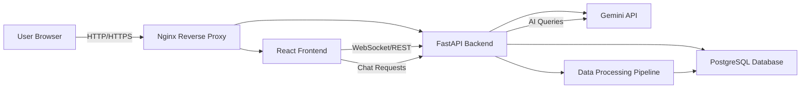

# Proof of Concept (POC)

## Project Objective

Build a Civic Budget Transparency & Project Accountability Platform that connects public budget allocations to real-world project execution, enabling citizens to verify infrastructure progress, monitor expenditure, and engage with an AI assistant.

## Problem Validation

Citizens currently lack a single source of truth for:

- how public funds are allocated across departments
- whether budgeted projects are executed on time
- whether taxpayer money produces visible, measurable outcomes

This gap reduces trust in government spending and limits civic participation.

## Existing Solutions Analysis

Existing civic transparency tools often provide:

- raw budget dashboards without project linkage
- static reports lacking citizen feedback
- limited AI-based explanation or conversational access

Those solutions are valuable, but they do not fully connect budget allocations with community-led project verification.

## Proposed Innovation

This platform combines:

- budget allocation analytics
- department-wise expenditure tracking
- project execution monitoring
- citizen verification reporting
- Gemini-powered conversational insights

The innovation is in uniting financial transparency with on-the-ground accountability and intelligent civic engagement.

## Technical Feasibility

The MVP is achievable using the chosen stack:

- FastAPI for backend APIs and validation
- PostgreSQL for robust data storage
- React + Vite + Tailwind for responsive dashboards
- Recharts for interactive data visualizations
- Gemini API for AI explanations and chatbot support
- Docker and Nginx for deployment consistency

## System Architecture

### Architecture Diagram

## Database Design

Core entities:

- `users`
- `departments`
- `budget_allocations`
- `projects`
- `project_status`
- `verification_reports`
- `evidence_items`
- `chat_sessions`

### Example Schema

- `users`: id, name, email, role, created_at
- `departments`: id, name, category, allocated_amount
- `budget_allocations`: id, department_id, fiscal_year, amount, notes
- `projects`: id, title, department_id, budget_id, status, progress_percent
- `project_status`: id, project_id, phase, updated_at, notes
- `verification_reports`: id, user_id, project_id, description, status, submitted_at
- `evidence_items`: id, report_id, file_url, caption, verified

## API Design

### Core API Contracts

- `GET /api/budgets` — list budget allocations by department and year
- `GET /api/projects` — list active and historical projects
- `GET /api/projects/{id}` — fetch project details and evidence
- `POST /api/reports` — create a citizen verification report
- `GET /api/reports` — list verification submissions
- `POST /api/chat` — send user query to Gemini-assisted chatbot
- `POST /api/auth/login` — authenticate users
- `POST /api/auth/register` — register new citizens

## AI Integration Flow

1. User submits a chatbot query through the frontend.
2. Backend normalizes the request and appends relevant budget/project context.
3. Gemini API processes the query and returns an explanation or recommendation.
4. Backend formats the response for the UI and stores logs for review.
5. The chatbot helps users interpret budget data and verify progress.

## User Journey

1. Citizen logs in or registers.
2. They review the budget dashboard for allocations and expenditure trends.
3. They select a project to view execution status and completion metrics.
4. They submit a verification report with evidence if they observe discrepancies.
5. They ask the AI chatbot for simplified budget explanations and accountability insights.

## Expected Outcomes

- improved citizen understanding of public spending
- faster identification of delayed or underfunded projects
- richer accountability through community evidence
- accessible AI-powered explanations for non-technical users

## MVP Success Metrics

- budget allocation and project dashboards deployed
- department expenditure analytics available
- active project status tracking implemented
- citizen report submission workflow functional
- Gemini chatbot provides meaningful answers
- usability validated with sample users

## Future Scalability Plan

- integrate real-time public procurement and tender data
- add geospatial mapping for project locations
- support federated city/state budget comparisons
- extend AI to generate policy insights and trend reports
- create public transparency APIs for open data initiatives
