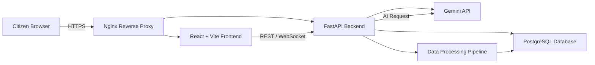

# Civic Budget Transparency & Project Accountability Platform

## Project Overview

The Civic Budget Transparency & Project Accountability Platform is an AI-powered civic technology solution designed to connect public budget allocations with real-world project execution. Citizens gain visibility into how taxpayer funds are spent, track infrastructure progress, and report verification evidence through an intelligent transparency dashboard.

## Problem Statement

Citizens lack visibility into how allocated public funds translate into actual on-ground development projects, making it difficult to track accountability, monitor project progress, and understand how taxpayer money is being utilized.

## Solution Overview

This platform delivers a unified civic transparency experience by:

- visualizing government budget allocations
- analyzing department-wise expenditures
- tracking project execution status and completion metrics
- enabling citizen verification reports and evidence uploads
- providing an AI chatbot powered by Gemini for simplified budget explanations

## Features

- Budget allocation dashboards
- Department expense analytics
- Project status monitoring
- Completion and variance metrics
- Citizen verification reporting
- Evidence upload for project progress
- Gemini-powered chatbot
- Transparency dashboards and analytics

## Architecture Diagram



## Technology Stack

### Frontend

- React
- Vite
- Tailwind CSS
- Recharts

### Backend

- FastAPI
- PostgreSQL
- Pandas
- Gemini API

### Infrastructure

- Docker
- Nginx

## Installation Steps

1. Clone the repository:
   ```bash
   git clone https://github.com/your-org/civic-budget-transparency.git
   cd civic-budget-transparency
   ```
2. Build the Docker environment.
3. Configure environment variables for database and Gemini API access.
4. Launch frontend and backend services.

## Local Setup Instructions

1. Copy sample environment files and update secrets.
   ```bash
   cp .env.example .env
   ```
2. Start containers:
   ```bash
   docker compose up --build
   ```
3. Access the application at `http://localhost:3000`.
4. Confirm backend API is available at `http://localhost:8000`.

## API Overview

### Core Endpoints

- `POST /api/auth/register` — register users
- `POST /api/auth/login` — authenticate users
- `GET /api/budgets` — retrieve budget allocations
- `GET /api/projects` — retrieve projects and execution status
- `GET /api/projects/{id}` — retrieve detailed project data
- `POST /api/reports` — submit citizen verification reports
- `POST /api/chat` — send questions to Gemini chatbot

### API Capabilities

- Fetch budget and project analytics
- Support citizen evidence submission
- Provide AI-driven explanations for budget data
- Secure endpoints with authentication and validation

## Team Members

- **Pandurangareddy** — Technical Lead & Primary System Architect
- **Munindra** — Frontend Engineer
- **Saicharan** — Data & QA Engineer

## Future Enhancements

- Real-time public procurement integration
- Geospatial mapping of projects
- Federated city/state budget comparisons
- Advanced AI insights for policy and transparency
- Open public APIs for civic data access

## License

This project is released under the MIT License.
